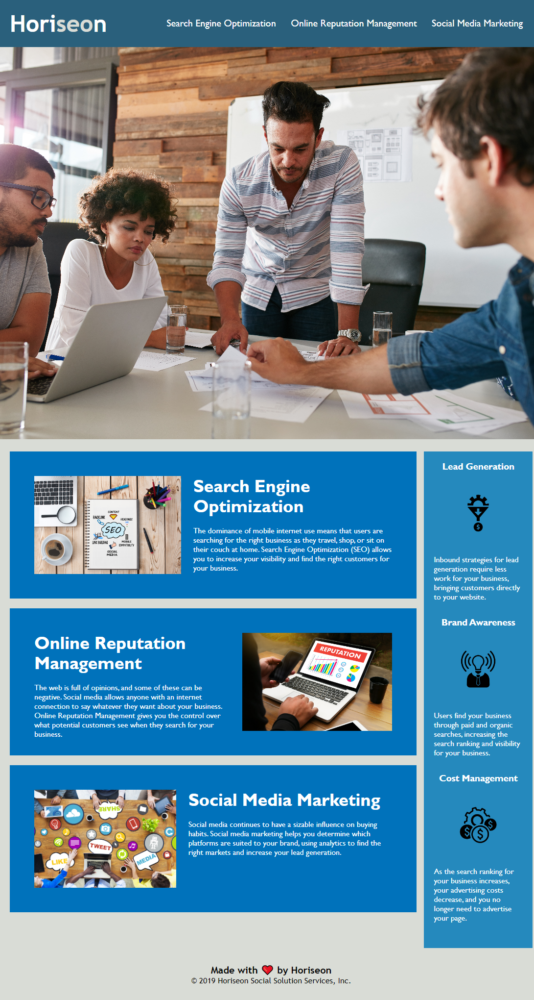

# First-Week-Challenge

## Code Refactoring

### In this project I am refactoring a starter code, so that its web accessibility is smoother by making the following changes:

* Consolidating and reorganized the CSS
* Changing class names in the html that were redundant
* Changing the HTML elements to include semantics HTML elements
* Adding “alt” attributes to the images and icons 
* Making sure the links work properly 
* Updated the title of the page

## Deployed Website

## Link to the website:
### https://patrickwlowe.github.io/First-Week-Challenge/

## Getting Started

### Make a clone of this repository in your local device using GitBash or Terminal(Mac) and SSH key for the repository found below:

### https://github.com/PatrickWLowe/First-Week-Challenge

## References

### https://www.w3schools.com/html/html5_semantic_elements.asp
### https://github.com/git-guides/git-push
### https://docs.github.com/en/repositories/managing-your-repositorys-settings-and-features/customizing-your-repository/about-readmes
### https://developer.mozilla.org/en-US/docs/Web/CSS

